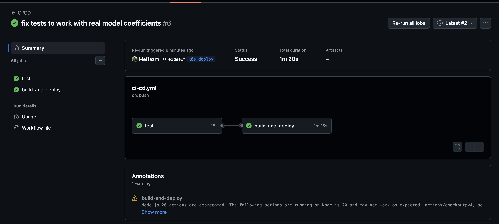
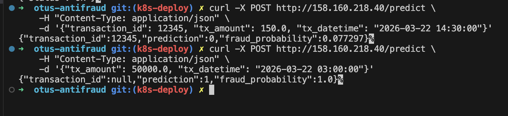

# otus-antifraud

Система обнаружения мошеннических финансовых транзакций.
Учебный проект курса [MLOps (Otus)](https://otus.ru/).

## Архитектура

```
S3 (raw CSV) → Airflow DAG → DataProc (PySpark) → S3 (Parquet)
                    ↑                                    ↓
               расписание                    Model Training (PySpark)
                                                    ↓
                                    MLflow (VM + Managed PostgreSQL)
                                        ├── метрики → PostgreSQL
                                        └── модель  → S3 artifacts

                          Streaming Inference (HW_08):
S3 (Parquet) → kafka_producer.py → Kafka [transactions]
                                        ↓
                            Spark Structured Streaming
                          (PipelineModel из MLflow/S3)
                                        ↓
                                Kafka [predictions]

                          REST API + K8s (HW_09):
GitHub push (main) → GitHub Actions → pytest → Docker build
                                                    ↓
                                        YC Container Registry
                                                    ↓
                                    Managed Kubernetes (3 узла)
                                        ├── Deployment (2 реплики)
                                        └── Service (LoadBalancer)
                                                    ↓
                                        POST /predict → FastAPI (numpy)
```

## Структура репозитория

```
├── infra/                  # Terraform — инфраструктура Yandex Cloud
│   ├── main.tf             # SA, VPC, S3, Airflow, MLflow, PostgreSQL, Kafka
│   ├── scripts/            # Cloud-init скрипты (MLflow, DataProc init)
│   └── Makefile            # apply, destroy, upload-all, urls
├── dags/
│   ├── data_cleaning_dag.py   # DAG — автоочистка данных (daily)
│   ├── model_training_dag.py  # DAG — переобучение модели (weekly)
│   └── streaming_dag.py       # DAG — потоковый инференс (manual)
├── scripts/
│   ├── data_cleaning.py       # PySpark — очистка данных
│   ├── train_model.py         # PySpark — обучение модели + MLflow
│   ├── validate_model.py      # PySpark — A/B валидация модели
│   ├── kafka_producer.py      # Kafka producer — воспроизведение транзакций
│   ├── streaming_inference.py # Spark Structured Streaming — инференс
│   └── convert_model.py       # Конвертер PySpark модели → JSON
├── app/                       # FastAPI REST API
│   ├── main.py                # Эндпоинты (/predict, /health)
│   ├── model.py               # Загрузка модели и инференс (numpy)
│   └── features.py            # Конструирование признаков
├── k8s/                       # Kubernetes манифесты
│   ├── deployment.yaml        # Deployment (2 реплики)
│   └── service.yaml           # Service (LoadBalancer)
├── .github/workflows/         # CI/CD
│   └── ci-cd.yml              # GitHub Actions: test → build → deploy
├── Dockerfile                 # Образ для anti-fraud API
├── notebooks/
│   ├── data_quality_analysis.ipynb  # Анализ качества данных
│   └── feast_features.ipynb         # Feast Feature Store демо
├── feature_store/          # Feast — Feature Views
└── docs/                   # Проектная документация
```

## Инфраструктура

**Yandex Cloud** (Terraform):
- **S3** — данные, DAG, скрипты, артефакты MLflow
- **Managed Airflow** — оркестрация пайплайнов
- **Managed PostgreSQL** — backend store для MLflow
- **Managed Kafka** — потоковая передача транзакций и предсказаний
- **VM** — MLflow Tracking Server (порт 5000)
- **DataProc** — эфемерный Spark-кластер (создаётся/удаляется через DAG)
- **Managed Kubernetes** — K8s кластер (3 узла) для деплоя REST API
- **Container Registry** — реестр Docker-образов
- **VPC** — сеть с NAT-шлюзом и security group

Подробнее: [infra/README.md](infra/README.md)

## Данные

~1.9 млрд транзакций (40 файлов × ~47 млн строк). Доля fraud: ~6.5%.

Обнаружено 6 типов проблем качества → автоматическая очистка → Parquet.

## ДЗ №8 — Инференс на потоке

### Что сделано

1. **Apache Kafka** (Managed Service) — кластер `otus-kafka` (Kafka 3.5, s2.micro, 32 ГБ SSD):
   - Topic `transactions` (3 партиции) — входящие транзакции
   - Topic `predictions` (3 партиции) — результаты скоринга
   - Пользователи `producer` и `consumer` с SASL_SSL + SCRAM-SHA-512

2. **Kafka Producer** (`scripts/kafka_producer.py`):
   - Читает очищенные данные из S3 (Parquet) через PySpark
   - Отправляет транзакции в Kafka пакетом (`--limit` сообщений)

3. **Spark Structured Streaming** (`scripts/streaming_inference.py`):
   - Читает поток транзакций из Kafka topic `transactions`
   - Создаёт признаки (те же, что в `train_model.py`)
   - Загружает обученную PySpark ML PipelineModel из S3
   - Применяет модель к потоку и пишет предсказания в topic `predictions`
   - JSON-формат: `tranaction_id`, `prediction`, `ground_truth`, `event_time`, `scored_at`

4. **Airflow DAG** (`dags/streaming_dag.py`):
   - Создаёт эфемерный DataProc кластер (с init-скриптом для Kafka SSL)
   - Запускает producer и streaming inference последовательно
   - После завершения удаляет кластер (trigger_rule=ALL_DONE)
   - Запуск вручную (schedule=None)

5. **MLflow** — используется существующий сервер; модель загружается из S3 по пути (champion)

6. **Terraform** — кластер Kafka, topics, users, SG rules добавлены в `infra/main.tf`

### Как воспроизвести

```bash
# 1. Поднять инфраструктуру (Kafka добавится к существующим ресурсам)
cd infra
# Добавить kafka_password в terraform.tfvars
terraform apply -auto-approve

# 2. Загрузить скрипты и DAG в S3
make upload-all

# 3. Обновить переменные Airflow
#    Admin → Variables → Import Variables → airflow_variables.json

# 4. Запустить DAG streaming_inference из Airflow UI
```

### Оценка производительности

Тестирование проводилось на 1 data node (s3-c4-m16, 4 vCPU, 16 GB RAM).
Модель: LogisticRegression (PySpark ML Pipeline). Streaming duration: 60 секунд.

| Отправлено | Всего в топике | Обработано | TPS     | Очередь растёт? |
|-----------|---------------|-----------|---------|-----------------|
| 3,000     | 9,262         | 9,260     | ~154    | Нет             |
| 24,000    | 33,262        | 33,260    | ~554    | Нет             |
| 50,000    | 83,262        | 83,260    | ~1,388  | Нет             |
| 100,000   | 183,262       | 183,260   | ~3,054  | Нет             |
| 500,000   | 683,262       | 683,260   | ~11,388 | Нет             |
| 2,000,000 | 2,683,262     | 2,586,824 | ~26,391 | **Да (+96,438)**|

**Вывод:** очередь начинает расти при ~26,000+ TPS на 1 data node.
При нормальной нагрузке (50 TPS) и пиковой (400 TPS) система справляется с большим запасом.
Одного узла s3-c4-m16 более чем достаточно для требуемой пропускной способности.

## ДЗ №9 — REST API + Kubernetes

### Что сделано

1. **REST API** (`app/`) — FastAPI-сервис для скоринга транзакций:
   - `POST /predict` — принимает `tx_amount` и `tx_datetime`, возвращает `prediction` и `fraud_probability`
   - `GET /health` — проверка работоспособности
   - Модель: коэффициенты LogisticRegression извлечены из PySpark PipelineModel в JSON, инференс через numpy (sigmoid)
   - 48 тестов (features, model, API)

2. **Конвертер модели** (`scripts/convert_model.py`):
   - Читает PySpark PipelineModel из S3 (boto3 + pyarrow, без PySpark)
   - Извлекает feature names, коэффициенты LR, intercept
   - Сохраняет в `model/model.json`

3. **Docker** — `python:3.11-slim`, ~200 МБ образ (FastAPI + uvicorn + numpy + model.json)

4. **CI/CD** (`.github/workflows/ci-cd.yml`):
   - Триггер: push в `main` или `k8s-deploy`
   - Этапы: тесты (pytest) → сборка Docker → push в YC Container Registry → deploy в K8s
   - Автоматический деплой: `kubectl apply` + `rollout status`

5. **Kubernetes** (`k8s/`):
   - Deployment: 2 реплики, liveness/readiness probes на `/health`
   - Service: LoadBalancer (порт 80 → 8000)

6. **Terraform** (`infra/main.tf`):
   - `yandex_container_registry` — реестр Docker-образов
   - `yandex_kubernetes_cluster` — Managed K8s (зональный, публичный IP)
   - `yandex_kubernetes_node_group` — 3 узла (standard-v3, 2 vCPU, 4 ГБ RAM, preemptible)

### Скриншоты

| GitHub Actions CI/CD | Тестирование API |
|:---:|:---:|
|  |  |

### Как воспроизвести

```bash
# 1. Поднять K8s кластер и Container Registry
cd infra
terraform apply -auto-approve

# 2. Конвертировать модель (если нужно обновить model.json)
pip install boto3 pyarrow
python scripts/convert_model.py \
    --bucket BUCKET_NAME \
    --model-path models/model_20260321 \
    --output model/model.json

# 3. Настроить GitHub Secrets в репозитории:
#    YC_SA_KEY        — JSON ключ сервисного аккаунта
#    YC_FOLDER_ID     — ID каталога YC
#    YC_REGISTRY_ID   — terraform output -raw container_registry_id
#    YC_K8S_CLUSTER_ID — terraform output -raw k8s_cluster_id

# 4. Push в main → GitHub Actions автоматически:
#    - запустит тесты
#    - соберёт Docker-образ
#    - запушит в Container Registry
#    - задеплоит в K8s

# 5. Получить публичный IP сервиса
make kubeconfig
kubectl get svc antifraud-api

# 6. Тест API
curl -X POST http://<EXTERNAL-IP>/predict \
    -H "Content-Type: application/json" \
    -d '{"tx_amount": 150.0, "tx_datetime": "2026-03-22 14:30:00"}'
```

## ДЗ №10 — Мониторинг + автоскейлинг

### Что сделано

1. **HPA (Horizontal Pod Autoscaler)** — автоскейлинг от 4 до 6 реплик:
   - Целевое использование CPU: 80%
   - Политика масштабирования: до 2 подов за 60 секунд
   - `k8s/hpa.yaml`

2. **Prometheus-метрики в FastAPI** (`app/main.py`):
   - `starlette-exporter` — автоматические HTTP-метрики (RPS, латентность, статус-коды)
   - `predictions_total` — общее количество предсказаний
   - `fraud_predictions_total` — количество fraud-предсказаний
   - Эндпоинт `/metrics`

3. **Prometheus + Grafana** в K8s (Helm `kube-prometheus-stack`):
   - ServiceMonitor для scraping метрик приложения
   - Grafana дашборд «Anti-Fraud API» (RPS, предсказания, латентность, CPU, реплики)

4. **Алертинг** (`k8s/prometheusrule.yaml`):
   - Алерт `HighReplicaCountAndCPU`: 6 реплик И CPU > 80% в течение 5 минут
   - Severity: critical

5. **Airflow в K8s** (Helm `apache-airflow`):
   - DAGs синхронизируются из git-репозитория [otus-antifraud-dags](https://github.com/Meffazm/otus-antifraud-dags)
   - Периодическое переобучение модели (weekly) с фиксацией метрик в MLflow

6. **Нагрузочное тестирование** (`scripts/load_test.py`):
   - Контролируемая генерация HTTP-трафика (~20 RPS)
   - Имитация DDoS-атаки для проверки HPA и алертинга

### Как воспроизвести

```bash
cd infra

# 1. Установить Prometheus + Grafana
make helm-monitoring

# 2. Установить Airflow с git-sync
make helm-airflow

# 3. Применить HPA
make k8s-hpa

# 4. Доступ к UI
make grafana       # http://localhost:3000
make prometheus    # http://localhost:9090
make airflow-ui    # http://localhost:8080 (admin/admin)

# 5. Нагрузочное тестирование
make k8s-load-test
```

## Прогресс

| Этап | Статус | Ветка |
|------|--------|-------|
| Инфраструктура (Terraform, S3, DataProc) | ✅ | `infra-testing` |
| Анализ качества и очистка данных | ✅ | `data-drift` |
| Feature Store (Feast) | ✅ | `feature-store` |
| Автоматизация пайплайна (Airflow) | ✅ | `autoclean` |
| Обучение модели + MLFlow | ✅ | `retrain` |
| Валидация модели (A/B тестирование) | ✅ | `validation` |
| Инференс на потоке (Kafka + Spark Streaming) | ✅ | `streaming` |
| REST API + Kubernetes (CI/CD) | ✅ | `k8s-deploy` |
| Мониторинг + автоскейлинг | ✅ | `monitoring` |

## Документация

- [Цели и метрики](docs/01_goals_and_metrics.md)
- [MISSION Canvas](docs/02_mission_canvas.md)
- [Декомпозиция системы](docs/03_system_decomposition.md)
- [S.M.A.R.T. задачи (MVP)](docs/04_smart_tasks.md)
