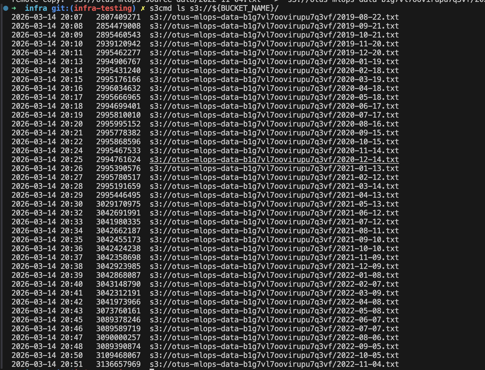
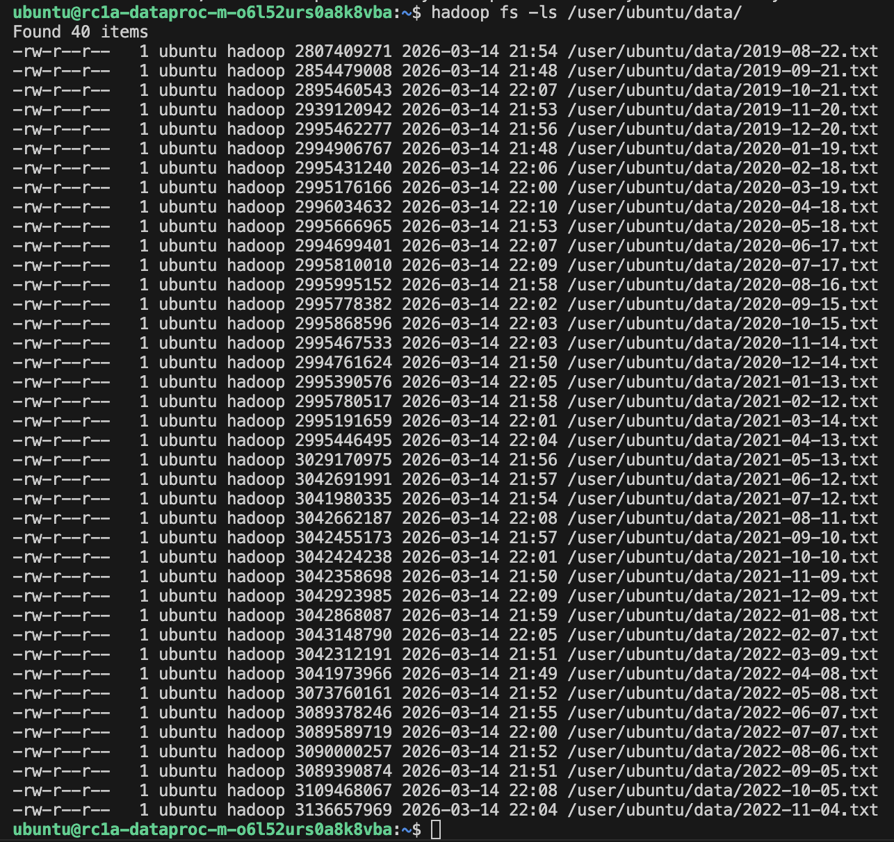

# Облачная инфраструктура для проекта Anti-Fraud

## Описание

Terraform-конфигурация для развёртывания инфраструктуры в Yandex Cloud:
- S3-бакет для хранения данных о транзакциях
- VPC-сеть с NAT-шлюзом и группой безопасности
- Spark-кластер Yandex Data Processing (HDFS, YARN, SPARK, HIVE, TEZ)

## Состав кластера

| Подкластер | Класс хоста | Кол-во хостов | Диск |
|------------|-------------|---------------|------|
| Master     | s3-c2-m8    | 1             | 40 ГБ (network-ssd) |
| Data       | s3-c4-m16   | 3             | 128 ГБ (network-ssd) |

## Быстрый старт

```bash
cp terraform.tfvars.example terraform.tfvars
vi terraform.tfvars # заполнить yc_token, yc_cloud_id, yc_folder_id

make init
make plan
make apply
```

## Точка доступа к бакету

https://storage.yandexcloud.net/otus-mlops-data-b1g7vl7oovirupu7q3vf (удалена после `make destroy`)



## Содержимое HDFS



## Оценка затрат
С учетом фактора репликации 3 на кластере HDFS:

Цена кластера Data Proc - 29 561,93 р в месяц
Intel Ice Lake 100% 2vCPU 8Gb RAM 40Gb SSD (master)
3x Intel Ice Lake 100% 4vCPU 16Gb RAM 128Gb SSD (workers)

Цена  S3-buckets - 327,72 р в месяц
Стнадартный Object Storage 128Gb, 100 000 GET/POST-операций

Очевидно вариант хранения в S3-бакетах - гораздо выгоднее.

## Удаление

```bash
make destroy
```
